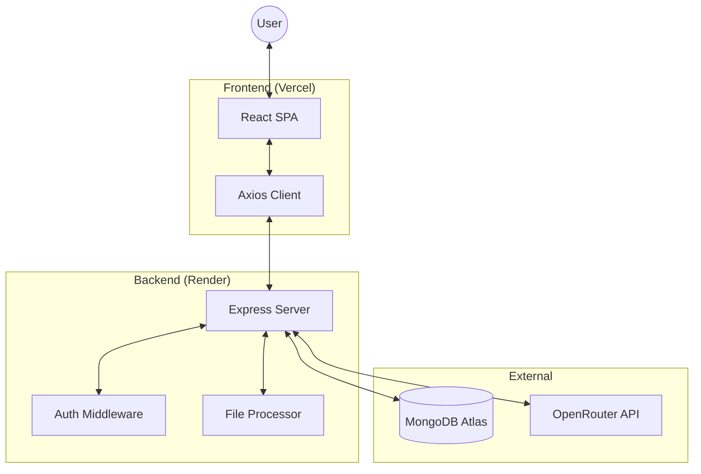

# 🏗️ Architecture & Design

This document provides a high-level overview of the **AgentX Chatbot Platform**'s technical architecture, data flow, and key design principles.

## 🚀 Tech Stack
- **Frontend**: React (Vite), Tailwind CSS, React Router.
- **Backend**: Node.js, Express.js.
- **Database**: MongoDB (Atlas).
- **AI/LLM**: OpenRouter API (Accessing various models like Claude, GPT).
- **File Processing**: Multer (In-memory), pdf-parse.
- **Authentication**: JWT (JSON Web Tokens).

## 🏛️ High-Level Architecture

## 🔄 Core Data Flows

### 1. Authentication
1. User submits credentials (Login/Register).
2. Backend validates via MongoDB and signs a **JWT**.
3. Frontend stores JWT in `localStorage`.
4. All subsequent API calls include the JWT in the `Authorization` header.

### 2. Knowledge Base (RAG Implementation)
1. User uploads a PDF/Text file.
2. Backend extracts raw text using `pdf-parse`.
3. Extracted text is stored directly in the `File` collection in MongoDB, linked to a specific `Project`.
4. During chat, the backend fetches all file content associated with the project.
5. This content is injected into the **System Prompt** as context before sending the request to **OpenRouter**.

### 3. Chat Workflow
- **Prompting**: Users can define specific "System Prompts" for their agents.
- **Context Injection**: The platform combines User Message + Project Files + Active Prompt title/content.
- **Streaming (Future)**: Currently uses standard JSON responses; streaming is planned for future versions.

## 🛠️ Key Design Decisions
- **Security**: Password hashing using `bcryptjs` and session management via JWT.
- **Simplicity**: No complex vector database (Pinecone/Milvus) is used for now. Files are processed "on-the-fly" and injected into prompt context to keep the project lightweight and easy to deploy.
- **Responsiveness**: Mobile-first design using Tailwind CSS utility classes and a custom drawer navigation.

---

[Back to README](file:///Users/darshankalburgi/Desktop/chatbot/README.md)
