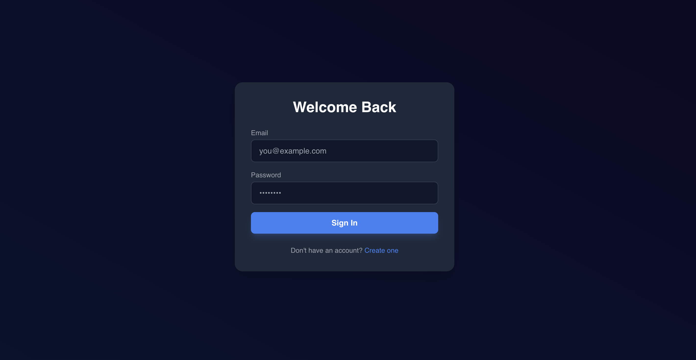
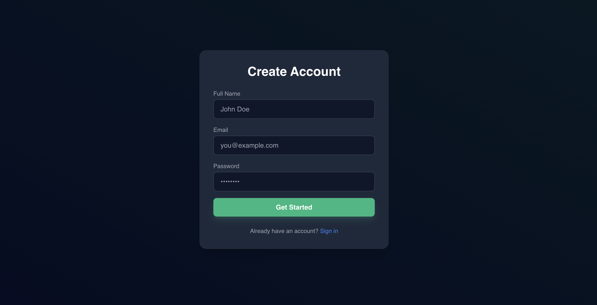
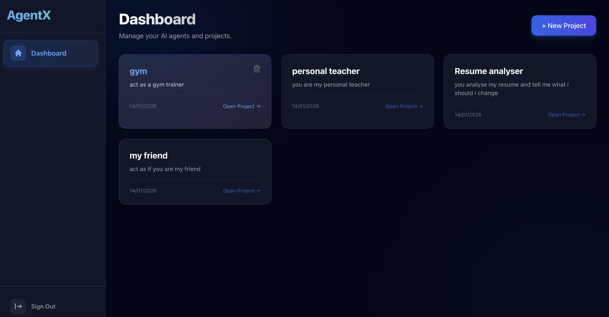
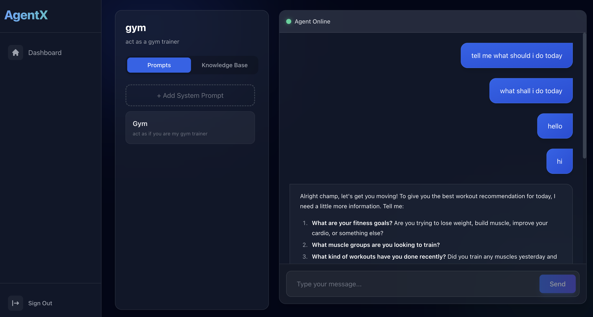

# Chatbot Platform - MERN Stack

A modern chatbot platform built with the MERN stack (MongoDB, Express, React, Node.js), featuring project-based AI agents with document text extraction (PDF/Plain Text) and chat persistence.

## 🖼️ Screenshots
<p align="center">
  
  
</p>
<p align="center">
  
  
</p>
<p align="center">
  
</p>

## 🚀 Features
- **Project Management**: Create and manage multiple AI projects.
- **File Upload & Knowledge Base**: Upload PDFs and text files to projects. Automatic text extraction using `pdf-parse`.
- **AI Chat**: Interactive chat interface powered by OpenRouter (OpenAI/LLMs).
- **History**: Full chat history persistence for each project.
- **Authentication**: Secure user registration and login with JWT.
- **Clean UI**: Responsive dashboard with glassmorphism aesthetics.


## 🛠️ Tech Stack
- **Frontend**: React, TypeScript, Tailwind CSS, Vite, Axios, React Router.
- **Backend**: Node.js, Express, TypeScript, Multer, JWT, Bcrypt.
- **Database**: MongoDB (Mongoose).
- **AI Integration**: OpenRouter API.

## ⚙️ Setup Instructions

### Prerequisites
- Node.js (v18+)
- MongoDB (Local or Atlas)
- OpenRouter API Key

### 1. Clone the repository
```bash
git clone <your-repo-url>
cd chatbot
```

### 2. Backend Setup
1. Navigate to the server directory:
   ```bash
   cd server
   ```
2. Install dependencies:
   ```bash
   npm install
   ```
3. Create a `.env` file in the `server` folder:
   ```env
   PORT=5001
   MONGO_URI=your_mongodb_connection_string
   JWT_SECRET=your_jwt_secret
   OPENROUTER_API_KEY=your_openrouter_api_key
   ```
4. Start the server:
   ```bash
   npm run dev
   ```

### 3. Frontend Setup
1. Open a new terminal and navigate to the client directory:
   ```bash
   cd client
   ```
2. Install dependencies:
   ```bash
   npm install
   ```
3. Start the development server:
   ```bash
   npm run dev
   ```
4. Open your browser at `http://localhost:5173`.

## 📤 Pushing to GitHub

Follow these steps to upload the project to your GitHub repository:

1. **Create a new repository** on GitHub (do not initialize with README).
2. **Initialize Git** in the project root:
   ```bash
   git init
   ```
3. **Add all files**:
   ```bash
   git add .
   ```
4. **Commit your changes**:
   ```bash
   git commit -m "Initial commit: Chatbot Platform with File Uploads and Project Deletion"
   ```
5. **Add the remote origin**:
   ```bash
   git remote add origin https://github.com/YOUR_USERNAME/YOUR_REPO_NAME.git
   ```
6. **Push to the main branch**:
   ```bash
   git push -u origin main
   ```

## 🛣️ API Routes


### Authentication (`/api/auth`)
- `POST /register`: Register a new user.
- `POST /login`: Log in and receive a JWT token.

### Projects (`/api/projects`)
- `GET /`: Get all projects for the authenticated user.
- `GET /:id`: Get details for a specific project.
- `POST /`: Create a new project.
- `DELETE /:id`: Delete a project and all associated data (files, chats, prompts).
- `GET /:projectId/prompts`: Get all prompts for a project.
- `POST /:projectId/prompts`: Add a new prompt to a project.

### Files (`/api/files`)
- `GET /:projectId`: List all files uploaded to a project.
- `POST /upload`: Upload a PDF or Text file (multi-part form data).
- `DELETE /:id`: Delete a specific file.

### Chat (`/api/chat`)
- `GET /:projectId`: Retrieve chat history for a project.
- `POST /`: Send a message and get an AI response (includes file context).

## 📄 License
This project is licensed under the MIT License.
